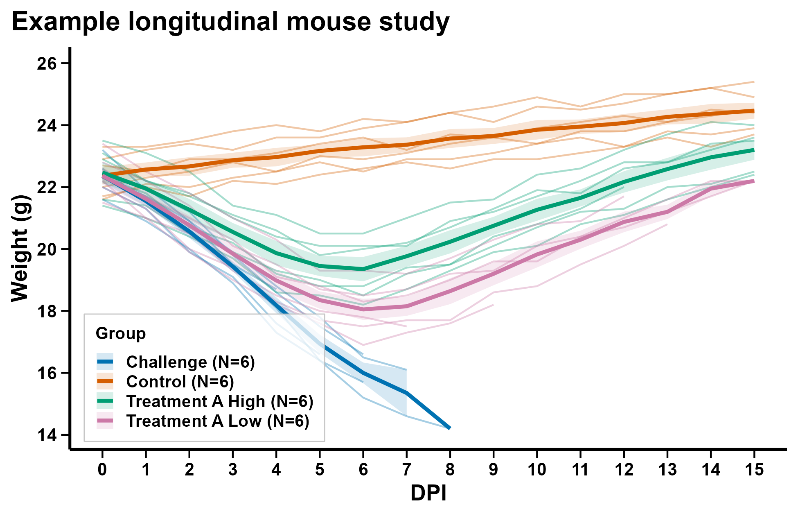
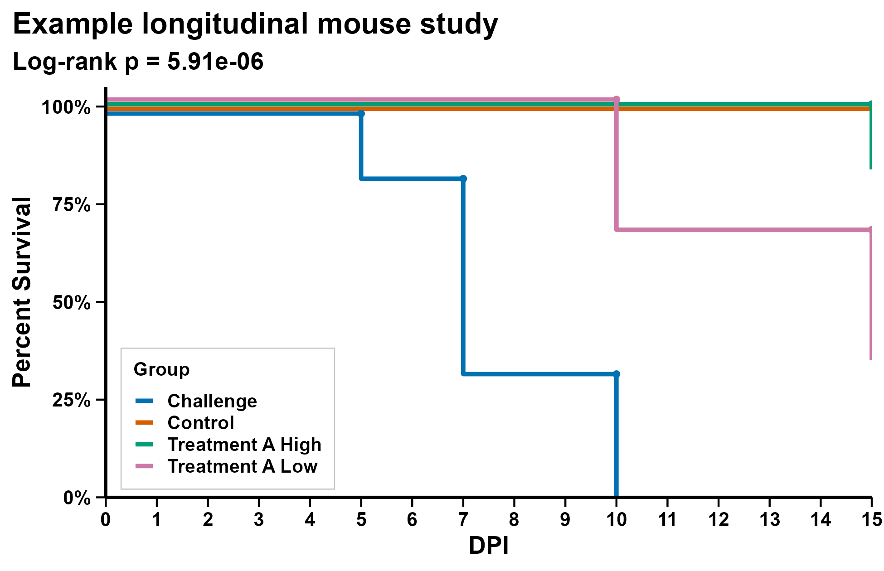

# Preclinical Study Analysis

R/Shiny app for longitudinal mouse study analysis. The public version focuses on a typical preclinical workflow: import study tables, review mapped fields, generate weight, clinical score, and survival outputs, and export figures plus analysis-ready CSV files.

## Key features
- CSV and Excel import with column mapping and validation
- Manual entry for longitudinal weight data
- Weight trajectory plots
- Clinical score plots
- Kaplan-Meier survival plots
- Summary statistics and pairwise tests
- Export of PNG, TIFF, PDF, and GraphPad-friendly CSV outputs
- Synthetic example files for local testing

## Quick start
```r
install.packages(
  c(
    "shiny", "bslib", "DT", "readr", "readxl", "dplyr", "tidyr",
    "ggplot2", "survival", "janitor", "stringr", "rappdirs",
    "scales", "colourpicker", "rhandsontable", "jsonlite",
    "shinyjs", "digest", "testthat"
  ),
  repos = "https://cloud.r-project.org"
)
source("scripts/dev_run.R")
```

For Windows PowerShell, `scripts/windows_run_public.ps1` will locate `Rscript.exe`, render example plots, and launch the app.

## Example outputs / screenshots
Weight trajectory example:



Kaplan-Meier survival example:



An app overview screenshot can be added later as `docs/img/app-overview.png`.

## Technologies used
R, Shiny, ggplot2, dplyr, survival, readr/readxl, renv

## Scope / limitations
The main focus here is the interactive analysis workflow. Some batch-reporting helpers remain in the repo, but institution-specific hosting, notification, and data-source configuration are intentionally omitted from the public release.
