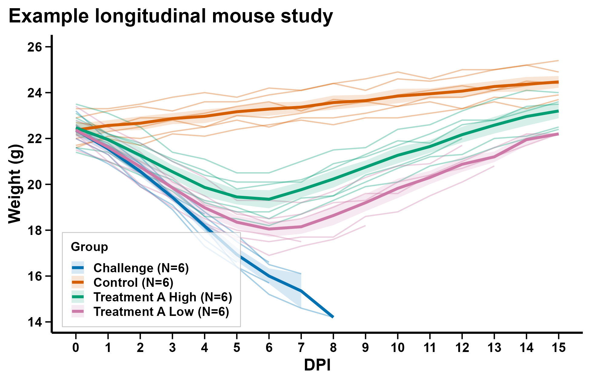
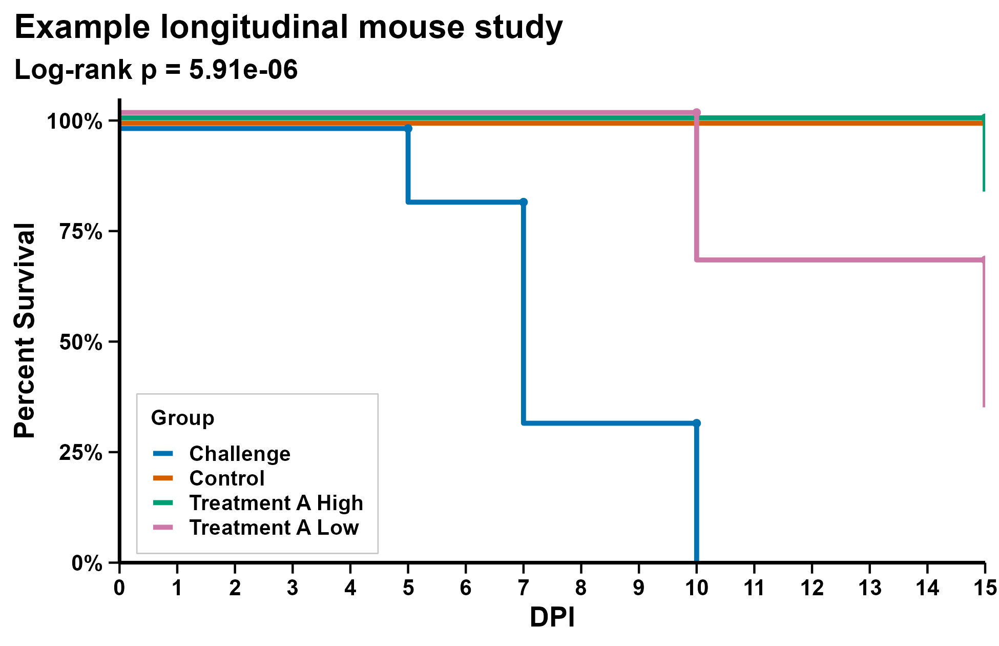

# Preclinical Study Analysis

[](https://github.com/aleponce4/preclinical-study-analysis-shiny/actions/workflows/check.yml)

R/Shiny application for longitudinal mouse study analysis. The public repository provides an end-to-end analytical workflow: import multi-table study data, map and validate field schemas, compute normalized weight trajectories and Kaplan-Meier survival curves, and export formatted figures alongside analysis-ready tabular data.

---

## 1. Overview

- **Input**: CSV or Excel study tables containing subject identifiers, treatment groups, temporal study days, body weights, clinical scores, and survival/censoring event statuses.
- **Output**: Publication-ready vector and raster plots (PNG, TIFF, PDF), normalized summary statistics, log-rank survival tests, and GraphPad-compatible exported CSV files.
- **Supported Execution**: Local R environment managed via `renv` or standard Windows PowerShell launcher (`scripts/windows_run_public.ps1`).
- **Validation Scope**: Verified with synthetic test fixtures and unit tests covering schema validation, baseline normalization algorithms, and plot generation contracts.

---

## 2. Key Features

- **Ingestion & Mapping**: Flexible CSV/Excel file import with auto-detection of column headers and interactive field mapping.
- **Direct Grid Entry**: Interactive `rhandsontable` spreadsheet interface for manual data entry or rapid editing.
- **Data Validation Engine**: Pre-analysis validation enforcing subject uniqueness, required coordinate columns, and numeric weight constraints before data transformation.
- **Body Weight Analytics**: Raw weight trajectory tracking and baseline-normalized body weight change (Day 0 baseline or first available observation).
- **Clinical Score & Survival Analytics**: Longitudinal clinical severity scoring and Kaplan-Meier survival estimation with log-rank statistical testing.
- **Export & Reporting**: High-resolution figure export with customizable themes, color palettes, axis constraints, and structured CSV exports.

---

## 3. Architecture & Modular Structure

The application follows a modular Shiny design pattern. UI components and server logic are separated into single-responsibility modules under [`app/R/`](app/R/):

```text
Data Ingestion / Direct Entry
            │
            ▼
    Field Mapping & Schema (`mapping.R`, `mod_import.R`)
            │
            ▼
    Data Validation Engine (`validate.R`)
            │
            ▼
    Data Transformation Engine (`transform_weights.R`, `transform_survival.R`, `transform_scores.R`)
            │
            ▼
    Visualization & Statistical Computation (`plots_weights.R`, `plots_survival.R`, `plots_scores.R`)
            │
            ▼
    Export Engine (`downloads.R`, `settings.R`, `palettes.R`)
```

### Key Modules

- [`mod_import.R`](app/R/mod_import.R) / [`mod_entry.R`](app/R/mod_entry.R): Ingestion interfaces handling file uploads, sheet parsing, and interactive data grids.
- [`mod_weights.R`](app/R/mod_weights.R) / [`mod_survival.R`](app/R/mod_survival.R) / [`mod_scores.R`](app/R/mod_scores.R): Shiny UI and server modules for endpoint-specific controls, filtering, and tab views.
- [`transform_weights.R`](app/R/transform_weights.R) / [`transform_survival.R`](app/R/transform_survival.R): Pure transformation functions for baseline percentage calculation, group aggregations, and survival curve fitting.
- [`validate.R`](app/R/validate.R): Rule-based validation engine trapping schema defects before execution.
- [`plots_weights.R`](app/R/plots_weights.R) / [`plots_survival.R`](app/R/plots_survival.R): `ggplot2` rendering wrappers enforcing consistent plot aesthetics, error bar calculations, and risk tables.

---

## 4. Reproducible Environment

Dependencies and version constraints are pinned via [`renv.lock`](renv.lock) targeting **R 4.4.2**.

To restore the pinned library environment locally:

```r
install.packages("renv")
renv::restore()
```

---

## 5. Data Validation & Error Handling

The application performs schema and data integrity checks via `validate_study_data()`. Hard errors prevent invalid data from propagating to downstream plotting routines, while non-fatal warnings highlight potential data quality issues:

- **Hard Validation Errors**:
  - Missing mandatory identifier columns (`Subject_ID` / `Animal_ID`, `Study_Day`).
  - Non-numeric or negative body weight observations.
  - Duplicate observations for a single subject on the same study day.
- **Informational Warnings**:
  - Unmapped treatment groups or missing baseline (Day 0) observations.
  - Inconsistent observation day intervals across study arms.

When errors are detected, the user interface presents actionable line-by-line feedback listing offending rows and column headers.

---

## 6. Automated Testing

The repository contains automated unit and integration tests under [`tests/testthat/`](tests/testthat/):

- **Data Ingestion & Mapping**: `test-import_csv.R`, `test-direct-entry.R`, `test-mapping.R`.
- **Calculations & Transformations**: `test-transform_weights.R`, `test-transform_survival.R`.
- **Validation Engine**: `test-validate.R`, `test-bugfixes.R`.
- **Plot Generation**: `test-plots.R`, `test-visual-settings.R`.
- **Automation Pipeline & CLI**: `test-automation-pipeline.R`, `test-automation-config.R`.

Run the full test suite from R using:

```r
testthat::test_dir("tests/testthat")
```

---

## 7. User Interface & Example Visualizations

Application User Interface:


Weight trajectory example:



Kaplan-Meier survival example:



---

## 8. Quick Start

### R / RStudio Execution

```r
# Load application dependencies and launch server
source("scripts/dev_run.R")
```

### Windows PowerShell Execution

```powershell
# Locate Rscript.exe, render default assets, and launch application
.\scripts\windows_run_public.ps1
```

---

## 9. Scope & Limitations

This repository presents the core interactive analysis and visualization workflow. Study data and institution-specific deployment configuration are not included in this public repository.


